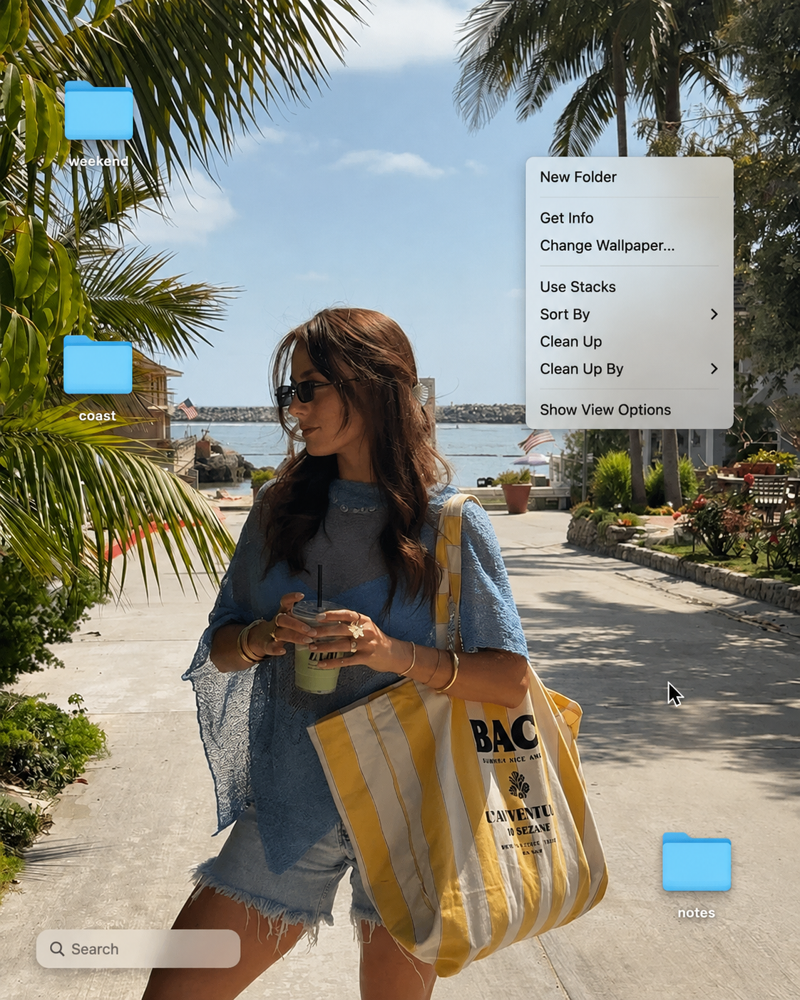
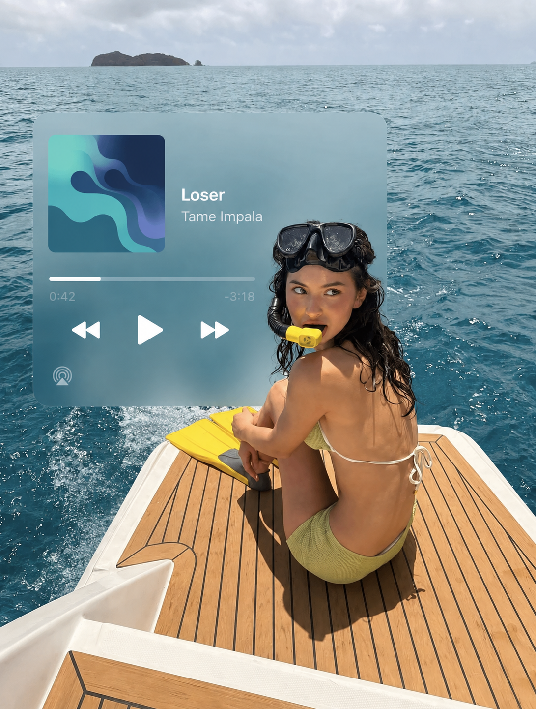
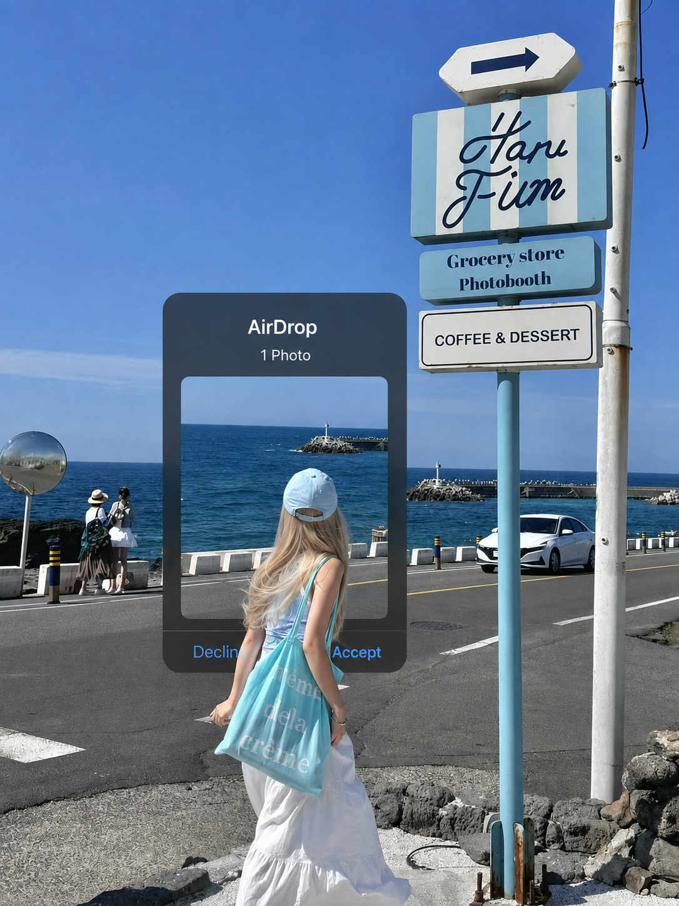
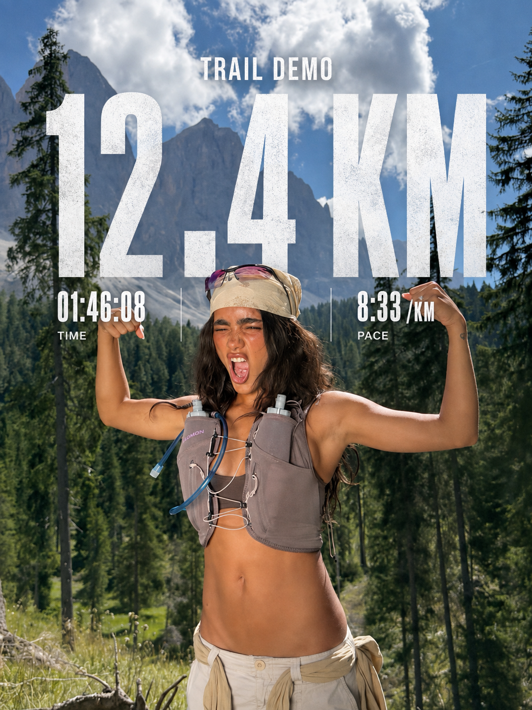

# Scene Overlay Composer

[中文](#中文) · [English](#english)

> Turn a supplied photo into a scene-native editorial composition: people stay in front, while UI, music players, activity data, and stickers become large visual layers that are genuinely integrated into the scene.

## 中文

### 这是什么

`Scene Overlay Composer` 是一组适用于 Codex 的图片合成 skills。它把人物照片与 iOS/macOS 原生界面、音乐播放器、运动记录、手绘贴纸等元素融合成编辑感创意贴图，一键快速复刻 IG 热门修图效果。


### 能做什么

| Skill | 效果 |
| --- | --- |
| `scene-native-ui-composer` | AirDrop、分享页、照片选择、日历、标签、窗口、文件夹和桌面。 |
| `scene-music-overlay` | 单曲播放器、透明歌单、环绕式多播放器卡片。 |
| `scene-activity-overlay` | 运动数据、路线、活动环与现场排版。 |
| `scene-editorial-stickers` | 涂鸦、星形、拼贴对象与大面积融合贴纸。 |

### 效果示意

| 效果1 | 效果2 | 效果3 | 效果4 | 效果5 |
| --- | --- | --- | --- |--- |
|  |  |  |  |  |


### 安装

克隆仓库后，将 `skills/` 内的五个文件夹复制到 Codex skills 目录：

```bash
git clone https://github.com/AprilJC/scene-overlay-composer-skill.git
cp -R scene-overlay-composer-skill/skills/* ~/.codex/skills/
```

重启或刷新 Codex。可直接描述需求让路由自动选择，也可以显式调用：

```text
$scene-native-ui-composer
$scene-music-overlay
$scene-activity-overlay
$scene-editorial-stickers
```

此包提供视觉决策与提示结构；图片生成或编辑需要你的 Codex 环境具有图像生成能力。

想获取更多 IG 灵感，欢迎关注作者小红书：[AprilJC](https://www.xiaohongshu.com/user/profile/5b9b0a013aad1900016fd73a)。

### 快速使用

先上传主图；如果还有界面截图或专辑封面，清楚说明其角色。

```text
$scene-native-ui-composer
图 1 是主图，图 2 仅作为 AirDrop 界面来源。
将大尺寸 AirDrop 接收卡放在人物身后；保留人物姿势、光线与构图，
让头发、夹克和腿遮住卡片边缘。不要覆盖脸、手或手机。
```

```text
$scene-music-overlay
用这张人像做主图，在人物背后的墙面加入一张大尺寸、半不透明的磨砂单曲播放器。
使用我提供的曲名、艺人和封面；人物需要遮挡卡片一角。
```

```text
$scene-editorial-stickers
主图不变。在人物身后加入一个大号粉色蜡笔星，身体要遮住星形，
使它改变人物轮廓，而不是孤立地漂浮在画面空处。
```

更多输入标注、层级和迭代方式见 [docs/USAGE.md](docs/USAGE.md)。

### 重要规则

- 主图是事实锚点：保留人物、服装、姿势、重要物品、环境、裁切与透视。
- 有真实 UI 截图时，以它的层级、控件、间距和可见文案为准。
- 单曲播放器默认在人物后方作为主视觉；只有脚、鞋或俯视腿部是主画面时，才可投影到地面。
- 歌单比单曲播放器更透明；多个播放器时使用不同尺度与深度的半透明卡片围绕人物。
- 为日历、运动、音乐等提供真实资料；不要把虚构信息伪装成真实账户或记录。

---

## English

### What it is

`Scene Overlay Composer` is a Codex skill pack for composing supplied photos with iOS/macOS interfaces, music players, activity records, and editorial stickers. It creates a spatial editorial result rather than a small pasted-on badge.

The essential rule is: **the person stays in the foreground; the interface or graphic continues behind them; hair, shoulders, clothing, bags, or legs naturally occlude its edges.** Faces, eyes, hands, phones, and held objects are protected.

### Included skills

| Skill | Use it for |
| --- | --- |
| `scene-overlay-composer` | Route a broad overlay request to the right specialist. |
| `scene-native-ui-composer` | AirDrop, share sheets, Photos selection, Calendar, tags, windows, folders, and desktop scenes. |
| `scene-music-overlay` | Now-playing cards, transparent playlists, and multi-card player compositions. |
| `scene-activity-overlay` | Workout data, routes, activity rings, and scene-native performance typography. |
| `scene-editorial-stickers` | Crayon doodles, stars, collage objects, and large fused stickers. |

### Install

Clone the repository, then copy the five folders inside `skills/` into your Codex skills directory:

```bash
git clone https://github.com/AprilJC/scene-overlay-composer-skill.git
cp -R scene-overlay-composer-skill/skills/* ~/.codex/skills/
```

Restart or refresh Codex. Describe the request normally for automatic routing, or invoke a specialist directly:

```text
$scene-native-ui-composer
$scene-music-overlay
$scene-activity-overlay
$scene-editorial-stickers
```

This pack supplies visual direction and prompt structure. Your Codex environment needs an image-generation or image-editing capability to render the result.

For more Instagram-style visual inspiration, follow the creator on [Xiaohongshu / RED](https://www.xiaohongshu.com/user/profile/5b9b0a013aad1900016fd73a).

### Quick start

Attach the main photo first. Attach any player/UI screenshot or album art, and identify each file's role.

```text
$scene-native-ui-composer
Image 1 is the main photo; Image 2 is only the AirDrop UI source.
Place a large AirDrop receive card behind the person. Preserve the pose, lighting,
and crop; let their hair, jacket, and legs overlap the card edge. Do not cover the face, hands, or phone.
```

```text
$scene-music-overlay
Use this portrait as the main photo. Put one large semi-opaque frosted now-playing card
on the wall behind the subject. Use the supplied title, artist, and artwork exactly;
the subject must interrupt one card edge.
```

```text
$scene-editorial-stickers
Keep the main photo unchanged. Add one large pink crayon star behind the person;
their body must cover the star so it changes the silhouette instead of floating in empty space.
```

Read [docs/USAGE.md](docs/USAGE.md) for image roles, hierarchy, depth language, and iteration guidance.

### Key rules

- Treat the main photo as factual: preserve the person, clothing, pose, important objects, setting, crop, and perspective.
- When a real UI screenshot is supplied, preserve its hierarchy, controls, spacing, and visible copy.
- A one-song player defaults to the principal background plane behind the person. Use a floor projection only when feet, footwear, or a downward-looking leg crop is compositionally primary.
- Playlists should be more transparent than a one-song card. For multiple players, surround the subject with unequal semi-transparent cards at varied depth.
- Provide real source material for calendars, activity metrics, and music metadata. Do not present invented information as a real account or record.

## Repository layout

```text
scene-overlay-composer-skill/
├── README.md
├── docs/
│   └── USAGE.md
├── examples/
│   └── generated/
└── skills/
    ├── scene-overlay-composer/
    ├── scene-native-ui-composer/
    ├── scene-music-overlay/
    ├── scene-activity-overlay/
    └── scene-editorial-stickers/
```

## Publishing note

Only publish example images you have permission to share.
